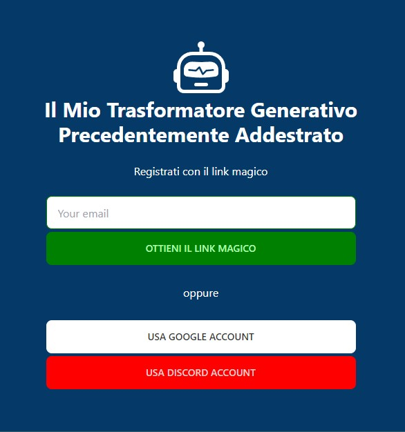
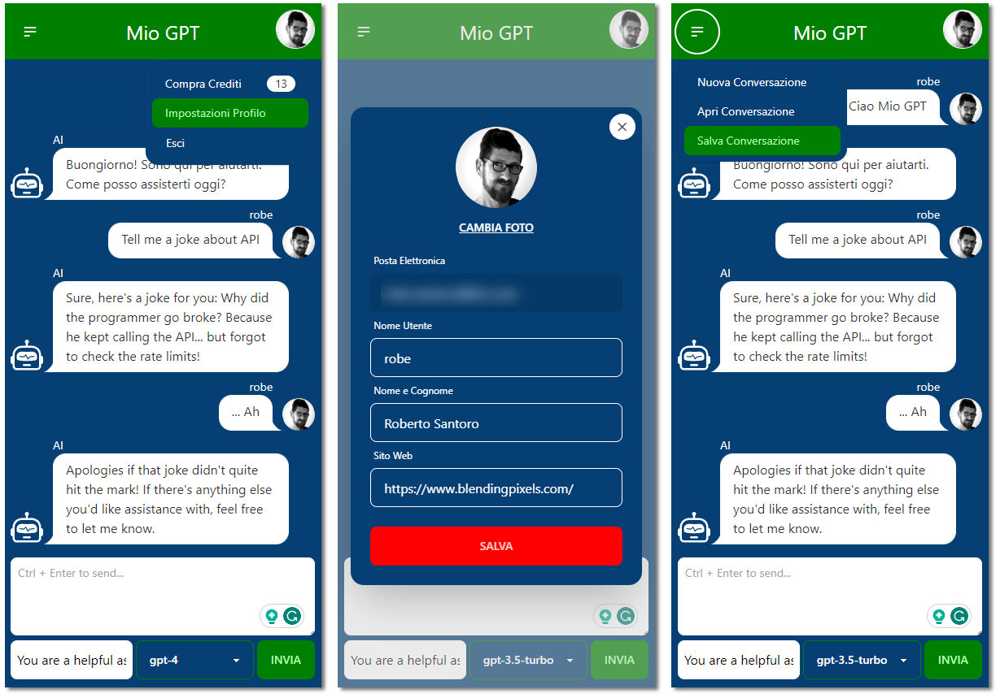

# Il mio Transformatore Generativo Precedentemente Addestrato

## **Mio GPT**

> In March 2022, the Guarantor's directive forced OpenAI to halt ChatGPT services in Italy. By April 11, the data privacy agency had outlined the necessary changes for OpenAI to relaunch ChatGPT in the country.

What chance to **have fun** with a new learning project, **make fun** of my country, and build a chatbot using the OpenAI API?

Of course with a nice Italian interface.

Starting from the scaffold by JS Mastery from [this YouTube tutorial](https://www.youtube.com/watch?v=2FeymQoKvrk&t=2s), I then:

- [x] Converted the client to React.
- [x] Added **Tailwind CSS** and **DaisyUI** for the interface.
- [x] Added **Supabase** authentication, and log in with a magic link.
- [ ] Log in with **Google Account** and **Discord**. ( ... TO DO )
- [x] Added Account Management with profile picture.
- [x] Added conversation autosave/autoload to/from local storage
- [x] Added possibility to load/save conversation in a local json file.
- [x] Added Select between GPT 3.5 or 4 and expose system instructions.

The server is running on Render.com and the client on Vercel at
[my-gpt-ruby.vercel.app](my-gpt-ruby.vercel.app). If is not working is beacuse I shut down the server to save money.

If you want to see a better implementation check out [this repo](https://github.com/mckaywrigley/chatbot-ui) by McKay Wrigley.
